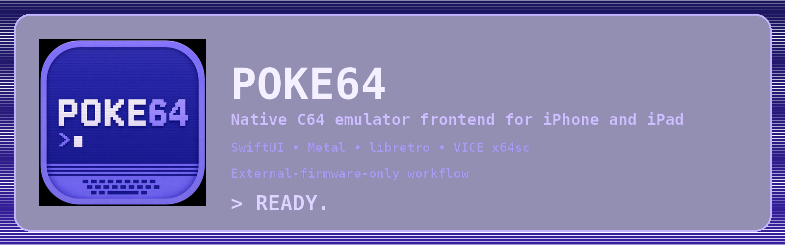

# POKE64

POKE64 is an experimental, native **Commodore 64 emulator for iPad**. It uses SwiftUI, UIKit, Metal, AVFoundation, the libretro API and the VICE `x64sc` core.

POKE64 is an independent open-source project. It is not affiliated with Commodore, VICE, RetroArch or libretro.

## Current features

- Native iPadOS interface with automatic C64 startup.
- Locally built and signed VICE `x64sc` libretro core.
- Metal video rendering and AVAudioEngine audio output.
- Hardware-keyboard input, an on-screen C64 keyboard and a virtual joystick assignable to C64 port 1 or 2.
- Multiple physical game controllers with D-pad/left-stick movement and A/B fire input.
- Commodore 1351 mouse input from the iPad touchscreen, trackpad or external mouse.
- Import and launch of supported C64 media through the iOS document picker.
- Settings panels for System, Graphics, Audio, Tape, Disk Drives, Printer, Firmware / ROMs, Networking and About.
- External BASIC, KERNAL and character ROM management, plus an optional 1541-II ROM slot.
- Compatible custom firmware support, including JiffyDOS-style replacements.
- Compact iPad toolbar with independent Port 1 and Port 2 assignment menus.
- Soft Reset, Hard Reset and **Eject Cartridge and Reset**.

Most Settings panels currently provide the interface structure only. Firmware / ROMs is the first fully implemented panel.

## Firmware policy

This repository and its release archives do **not** contain Commodore firmware, games, disk images, tapes or cartridges.

POKE64 currently requires the user to import legally obtained:

| Firmware | Size | Required |
|---|---:|:---:|
| C64 BASIC ROM | 8,192 bytes | Yes |
| C64 KERNAL ROM | 8,192 bytes | Yes |
| C64 character ROM | 4,096 bytes | Yes |
| 1541-II drive ROM | 16,384 bytes | No |

An optional redistributable open-firmware profile is planned.

## Development status

POKE64 is under active development and currently targets iPadOS 17 or later. iPhone and macOS adaptations are planned for a later stage.

D64 loading currently uses VICE Virtual Device Traps. True Drive Emulation and drive sounds remain temporarily disabled until the Disk Drives panel can manage drive models and ROMs reliably.

A cartridge remains inserted across Soft and Hard Reset, matching physical C64 behavior. Use **Reset → Eject Cartridge and Reset** to detach it and return to BASIC.

## Documentation

- [Build and development guide](Docs/BUILDING.md)
- [Architecture](Docs/ARCHITECTURE.md)
- [Roadmap](Docs/ROADMAP.md)
- [External-firmware testing](Docs/TESTING_EXTERNAL_FIRMWARE.md)
- [Third-party notices](THIRD_PARTY_NOTICES.md)

## Credits

Created by [Alessandro Capano](https://www.alexain.it/poke64) in 2026.

## Licensing

The original POKE64 application code is distributed under [LICENSE](LICENSE).

VICE and `vice-libretro` are separate GPL-licensed components. Distributors are responsible for the applicable source, notice and license obligations.

POKE64 does not license or distribute Commodore firmware or commercial content. Users and distributors are responsible for ensuring that imported firmware and media are lawfully used.
